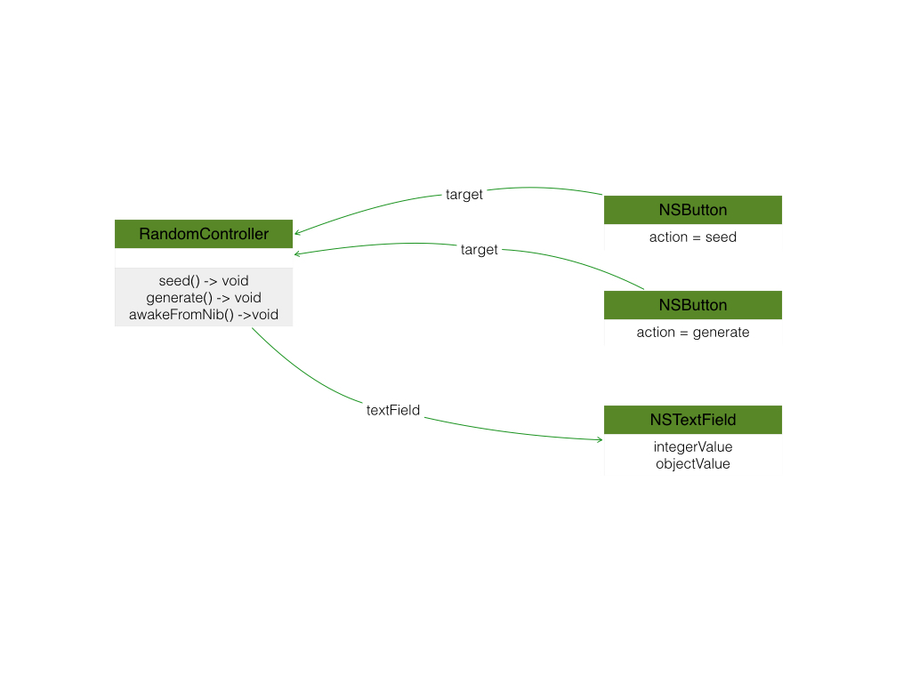

# Chaper2 Let's Get Started

A simple program which implentmens the function of generating a random number and displaying.  



Compared to Objective-C, the random number generation method has been changed to:  

```swift
// seed generation
srandom(UInt32(time(nil)))

// number generation
var generated = random()%100 + 1
```